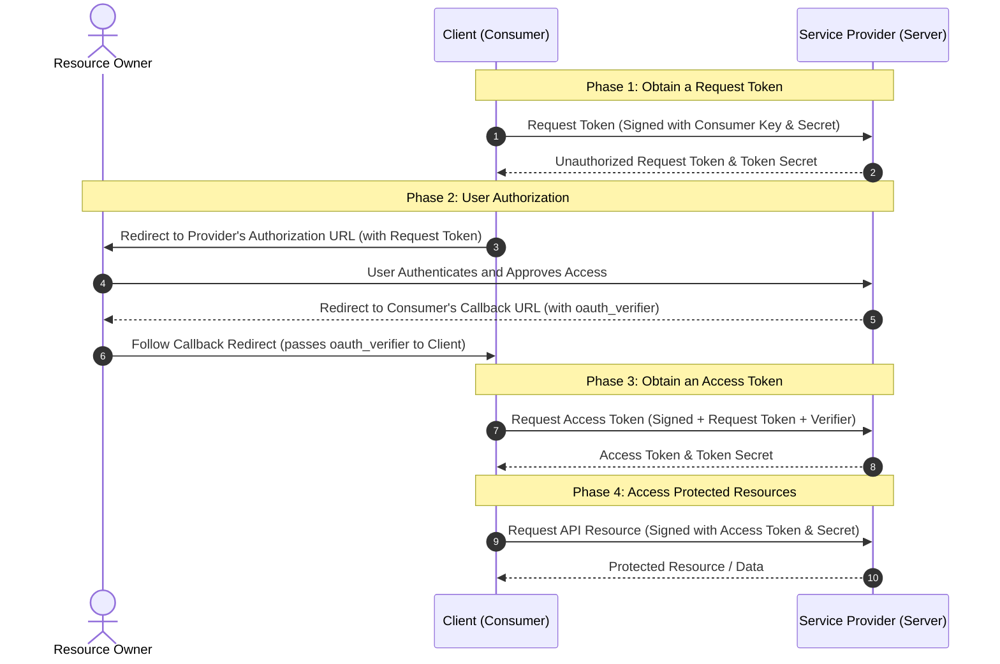
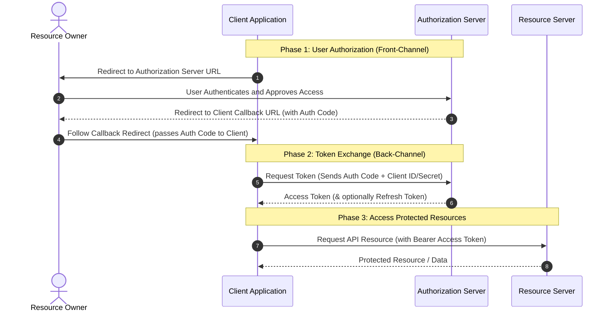
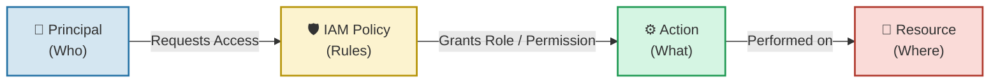

**Authentication** -> **Identity** an user

* Returns Session, ID token

**Authorization** -> check **Permission** of an user

* Returns Access token

## Authentication

### Authentication Factors

the actual pieces of evidence a user provides to prove their identity

* Knowledge, Possession(OTP, YubiKey, Authentication Key), Inherence(fingerprint), MFA(Multi-Factor Authentication), Password
* Defends against unauthorized access by requiring hard-to-fake proof.

### Authentication Protocols & Standards

communication rules systems uses to securely transmit, verify, and share that evidence across networks

* SAML, OIDC, FIDO/WebAuthentication
* Defends against network interception, replay attacks, and enables Single Sign-On(SSO).

#### Examples of Authentication Protocols & Standards

* SAML: Security Assertion Markup Language
  * As companies began adopting multiple web-based software systems in the early 2000s, employees suffered from “password fatigue”.
    * account management + security problem
  * Passing heavily structured, cryptographically signed XML documents called “**Assertion**s” between an Identity Provider(IdP, like Microsoft), and a Service Provider(SP, like Salesforce). When you login, the IdP hands the SP a signed XML certificate vouching for your identity.
    * An Assertion live for very short time, only used one-time, at the handshake moment.
  * To enable, centralized Enterprise SSO.
    * Battle-tested security, highly standardized for complex enterprise env, and universally supported by **legacy B2B software**
* XML is incredibly bulky and complex. extremely difficult to implement in modern mobile apps or **Single-Page Applications**(**SPA**s) as it was designed for traditional web browsers.
* OIDC: Open ID Connect
  * The smartphone revolution and the rise of modern, API-driven web apps. They exposed SAML's limitation. Developers needed a lightweight way to authenticate users.
  * OIDC is an identity layer build directly on top of the **OAuth2.0** framework. Instead of passing bulky XML, it uses lightweight **Json Web Tokens(JWTs)**. It authenticates the use and returns an ID Token alongside an Access Token. - **Google Login**!
  * To provide a developer-friendly, lightweight identity protocol optimized for **modern mobile and API-driven web** (B2C & B2B).
    * Extremely lightweight, natively compatible with REST APIs. However, configuring the exact grant types and securing the token lifecycle can be architecturally challenging as it relies on OAuth 2.0.
      * natively compatible with REST APIs? : It use JSON type web tokens, that REST APIs use.
      * securing token life-cycle? An OIDC token lives for a fixed time, normally 1\~2 hours. During this time, An OIDC token is repeatedly used for every single action. works as Let's assume someone's token is leaked. From server's perspective, there is no way to distinguish whether this token is stolen or legitimate. Developer need to directly design and manage an architecture that can immediately revoke or invalidate the token the moment a leak occurs.
* FIDO / WebAuthn : Fast Identity Online / Web Authentication)
  * The internet realized that passwords are fundamentally broken. No matter how complex a password is, it can be cheated.
  * FIDO / WebAuthn abandons shared secrets (passwords) entirely in favor of **Public Key Cryptography**. When you register, your device creates a unique cryptographic key pair. The public key goes to the server; the private key stacks locked in your device's secure hardware. Biometrics only serve to locally unlock that private key to sign a login challenge.
  * To achieve password-less Authentication and create systems that are technically immune to cheating.
    * Unphishable, no shared secrets to steal and a frictionless user experience. However, it relies highly on the user's physical device.

# Authorization

### Access Control Models

**Access Control Model** is a conceptual framework or logical models. Define the **theory** of “how you decide who gets access to a certain system"

* ACL (Access Control List): Direct mapping of user to resource. e.g) User John is on the list for Room A.
* RBAC (Role-Based Access Control): John has the role ‘manager’. Managers are allowed in Room A.
* ABAC (Attribute-Based Access Control): John is a Manager, trying to enter Room A, during business hours on a weekday. (dynamic rules, multiple conditions)

### Authorization protocol & standards

technical protocol - a standarized way for computers to talk to each other over the network.

#### OAuth 1.0

\

\
 view message flow \

* Obtain a Request Token (Steps 1-2):
  * The Consumer initiates the flow by asking the Service Provider for a temporary "Request Token".
  * This request is cryptographically signed using the Consumer's API Key and Secret.
  * The Service Provider validates the signature and replies with an unauthorized Request Token and a Token Secret.
* User Authorization (Steps 3-6):
  * The Consumer redirects the User's browser to the Service Provider's authorization page, passing the Request Token in the URL.
  * The User logs in to the Service Provider and explicitly grants the Consumer permission to access their data.
  * Once approved, the Service Provider redirects the User back to the Consumer using a pre-registered callback URL. This redirect includes an oauth\_verifier code (a security measure introduced in OAuth 1.0a to prevent session fixation attacks).
* Obtain an Access Token (Steps 7-8):
  * The Consumer asks the Service Provider to exchange the authorized Request Token for a permanent "Access Token".
  * This request is signed and must include the oauth\_verifier obtained in the previous step.
  * The Service Provider validates the request and issues the final Access Token and Access Token Secret. The Request Token is now invalidated.
* Access Protected Resources (Steps 9-10):
  * The Consumer can now make standard API calls on behalf of the User.
  * Every request to the Service Provider is signed using the Access Token and the Access Token Secret to prove authorization.

\

* In the early days of Web2.0, If user wanted to sign up for new app, users had to type actual Google password directly into the app.
* OAuth 1.0 allow users to grant third-party apps access to their data without handing over their password. It relies on rigorous cryptographic signing. If the user wants to access The client application and the authorization server share a secret key. For every single API request the client makes, it must use the secret key to generate a complex signature.
* It is extremely secure. Even if the request is intercepted on an unencrypted network like HTTP, the attacker cannot alter or replay the request. However, Implementing the cryptography correctly was notoriously difficult. Also, OAuth 1.0 protocol is unfriendly to mobile

#### OAuth 2.0

\

\
 brief explanation of the message flow \

Unlike OAuth 1.0, OAuth 2.0 relies entirely on HTTPS/TLS for encryption rather than requiring the client to cryptographically sign every request. It also explicitly separates the Authorization Server (which handles logins and issues tokens) from the Resource Server (which holds the data).

* User Authorization (Steps 1-4):
  * The flow starts when the Client redirects the User's browser to the Authorization Server.
  * The User logs in and reviews the permissions requested by the Client (the consent screen).
  * Once approved, the Authorization Server redirects the User back to the Client using a pre-registered callback URI. Appended to this URI is a short-lived Authorization Code.
  * Security Note: Passing a temporary code through the browser (front-channel) instead of the actual token prevents malicious scripts or browser extensions from stealing the permanent Access Token.
* Token Exchange (Steps 5-6):
  * The Client takes the Authorization Code it just received and makes a secure, server-to-server (back-channel) request directly to the Authorization Server.
  * In this request, the Client authenticates itself using its Client ID and Client Secret, proving it is the legitimate application.
  * The Authorization Server validates the code and the client's identity, and then responds with the final Access Token (and often a Refresh Token, which can be used to get new access tokens when the current one expires).
* Access Protected Resources (Steps 7-8):
  * The Client can now access the User's data.
  * To make an API call, the Client simply includes the Access Token in the HTTP request (typically in the Authorization: Bearer \<token> header).
  * The Resource Server validates the token and returns the requested data.

\

* The smartphone revolution. Mobile apps and SPAs could not safely store the “client secret”.
* Throws out cryptographic signing in favor of Bearer Tokens. Once a user authenticates and grants permission, the application is handed a token. To access data, the app simply presents this token in the HTTP header like a hotel keycard. Because the token is sent in plain text, OAuth 2.0 mandates that all traffic must be encrypted over HTTPS(TLS).
  * The client redirects the user's browser to the Authorization server. It simply passes its `client_id` and a `redirect_url` in a plain text
  * The user logs in and clicks “Allow”
  * The Authorization server redirects the user back to the Client's `redirect_url`, attaching a short-lived Authorization Code to the URL.
  * The client's backend server takes that Authorization code and makes a direct, hidden server-to-server request to the Authorization Server.
    * It sends the Code, its `client_id`, and its highly secure `client_secret`
  * The Authorization Server verifies the secret and the code, and returns a Bearer Access Token.
  * To access the data, the Client does zero cryptography. It simply places the token into HTTP header of a standard REST API call. `Authorization: Bearer <The_Access_Token>`
* Easy to implement and highly flexible. OAuth 2.0 introduces “grant types” tailored for different environments. However, OAuth 2.0 totally relies on HTTPS, and the flexibility causes the complexity.

## IAM

IAM, Identity and Access Management. Ensure that the **right people** have the **right right** to the **right resources** at the **right time**.

* IAM appears with the rise of Cloud computing like AWS, GCP, and Azure. Historically, companies used a “castle-and-moat” security system that trust users is in the office physically, and in the corporate network. However, the rise of cloud computing, mobile devices, and remote works dissolved this physical perimeter. Identity became the new perimeter.
  * +) The shift to the “Zero trust”. Services never trust an user or a device by default, even if they already have access to their network.
* IAM operates by centralizing the management of identities and enforcing access policies across an organization's resources.
  * Provisioning (Creation) : When a new employee joins(or a new service/app is deployed), an admin creates a digital identity for them in the IAM system.
  * Authentication (AuthN) : When the user tries to access a system, the IAM provider verifies they are who they claim to be. This is typically done using credentials like a password, combined with MFA.
  * Authorization (AuthZ) : Once logged in, the user requests access to a specific resource(e.g. a db or a doc.). The IAM system evaluates this request against predefined **Policies** via RBAC or ABAC.
  * Auditing and Logging 
  * Deprovisioning (Revocation) : When an employee leaves, their central IAM identity is disabled, which instantly revokes their access across all connected applications and systems.
* IAM provides enhanced security, improved user experience, and operational efficiency. Through a SSO(Single Sign-on), employees only need to log in once and their IAM portal manages all permissions. However, IAM system has high complexity, Management Overhead and Single point of failure.
